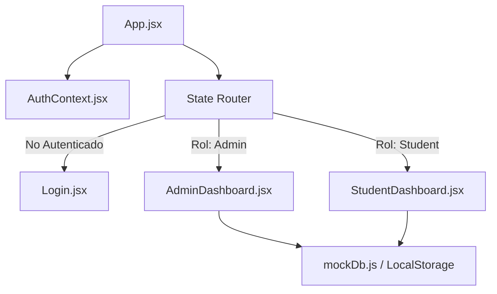

# Plan de Creación de MVP: Plataforma de Entrenamiento para Nómadas Digitales

Este documento detalla el plan para desarrollar la primera fase del MVP local de la plataforma de formación para nómadas digitales en España. El objetivo principal de este paso es establecer la seguridad, el control de acceso basado en roles (Admin vs. Nómada/Estudiante) y la estructura de datos local simulada que posteriormente se conectará a Supabase.

---

## User Review Required

> [!IMPORTANT]
> **Diseño de la Navegación y Rutas**
> Para mantener el desarrollo local rápido y evitar dependencias complejas al inicio del MVP, implementaremos un enrutador de estado interno en React (basado en `useState` y vistas condicionales). Si prefieres usar `react-router-dom` para tener URLs físicas en el navegador desde el primer día, avísame para incluirlo como dependencia.
>
> **Estructura del Canal de Comunicación**
> El canal de comunicación inicial simulará un chat de soporte o muro de anuncios donde los estudiantes pueden enviar mensajes o preguntas y el administrador puede responderlas. ¿Prefieres un formato tipo foro general, chat individual privado con el administrador, o muro de anuncios unidireccional?

---

## Open Questions

> [!NOTE]
> **1. Datos de los Usuarios de Prueba**
> ¿Los correos y contraseñas por defecto para las pruebas locales te parecen bien así?
> * **Administrador:** `admin@nomadahub.es` / `admin123`
> * **Nómada/Estudiante:** `nomada@nomadahub.es` / `nomada123`
> 
> **2. Categorías de Contenido inicial**
> Proponemos arrancar con categorías predefinidas como: "Trámites y Visados", "Impuestos y Autónomos", "Coworkings y Colivings" y "Herramientas Digitales". ¿Deseas agregar alguna otra de entrada?

---

## Proposed Changes

Para este MVP utilizaremos una arquitectura modular que permita reemplazar el "Mock Database" y el "Mock Auth" por servicios reales de Supabase en el futuro sin reescribir la interfaz de usuario.

---

### 1. Core & Security (Auth Simulation)

Crearemos un contexto de autenticación global en React para gestionar la sesión del usuario, sus credenciales locales y su rol.

#### [NEW] [AuthContext.jsx](file:///home/jonathanldme/Escritorio/Academy/src/context/AuthContext.jsx)
* Proveedor de contexto (`AuthContext`) que envuelve la aplicación.
* Estado `user` que almacena `{ id, email, name, role }` o `null`.
* Función `login(email, password)`: Valida las credenciales contra los usuarios de prueba.
* Función `logout()`: Limpia la sesión.
* Persistencia automática en `localStorage` para que la sesión no se cierre al recargar la página.

#### [NEW] [mockDb.js](file:///home/jonathanldme/Escritorio/Academy/src/utils/mockDb.js)
* Servicio simulado de base de datos que maneja lecturas y escrituras en `localStorage`.
* Estructuras de datos (tablas virtuales):
  * `resources`: `[ { id, title, type (video/document/presentation), url, description, category, tags, created_at } ]`
  * `messages`: `[ { id, sender_id, sender_name, sender_role, content, created_at } ]`
* Expone métodos asíncronos simulados (`async/await`) como `db.resources.getAll()`, `db.resources.create()`, `db.messages.send()`, etc. Esto facilitará enormemente la migración posterior a Supabase (`supabase.from().select()`).

---

### 2. UI Components & Views

Rediseñaremos la aplicación para renderizar diferentes pantallas según el estado de autenticación y el rol.

#### [MODIFY] [App.jsx](file:///home/jonathanldme/Escritorio/Academy/src/App.jsx)
* Integrar el `AuthProvider`.
* Implementar el enrutador condicional:
  * Si `user === null`: Mostrar la pantalla de Login.
  * Si `user.role === 'admin'`: Cargar el panel de administración.
  * Si `user.role === 'student'`: Cargar la vista de estudiante nómada.

#### [NEW] [Login.jsx](file:///home/jonathanldme/Escritorio/Academy/src/components/Login.jsx)
* Interfaz con estética premium y futurista (glassmorphism, gradientes modernos oscuros).
* Formulario de correo y contraseña.
* **Atajos de pruebas rápidas**: Dos botones para iniciar sesión con un solo clic como "Administrador de Prueba" o "Nómada de Prueba" para facilitar el testeo del MVP.

#### [NEW] [AdminDashboard.jsx](file:///home/jonathanldme/Escritorio/Academy/src/components/AdminDashboard.jsx)
* **Vista General**: Métricas de uso (estudiantes registrados, contenidos creados, mensajes pendientes).
* **Gestor de Contenidos**: Formulario para que el administrador agregue nuevos recursos de formación:
  * Título del recurso
  * Tipo (Video, Documento PDF, Presentación Guía)
  * Enlace/URL (por ejemplo, link de YouTube/Vimeo para videos, link de Google Drive/Notion para documentos)
  * Categoría y etiquetas
  * Descripción
* **Canal de Comunicación**: Bandeja de entrada para leer y responder mensajes o publicar anuncios oficiales.

#### [NEW] [StudentDashboard.jsx](file:///home/jonathanldme/Escritorio/Academy/src/components/StudentDashboard.jsx)
* **Directorio de Formaciones**:
  * Buscador y filtros rápidos por tipo de recurso (Video, Documento, Presentación) y categorías.
  * Tarjetas de contenido interactivas que abren el recurso en una pestaña nueva o en un modal embebido.
* **Canal de Comunicación**:
  * Formulario rápido para enviar preguntas o comentarios al administrador.
  * Visualización de anuncios importantes.

---

## Verification Plan

### Manual Verification
1. **Verificación de Login**:
   * Entrar a la app, ver la pantalla de login.
   * Probar credenciales incorrectas (debe mostrar error).
   * Hacer clic en "Iniciar como Admin" -> Debe redirigir al panel de administración.
   * Hacer clic en Cerrar Sesión -> Debe volver a la pantalla de login.
   * Hacer clic en "Iniciar como Nómada" -> Debe redirigir al panel de estudiantes.
2. **Prueba de Flujo de Contenidos**:
   * Iniciar como Admin.
   * Crear un nuevo recurso de tipo "Vídeo" llamado "Cómo registrarse de autónomo en España" con su enlace.
   * Cerrar sesión.
   * Iniciar como Nómada.
   * Verificar que el nuevo video aparece en la lista de formaciones de forma interactiva y que se puede filtrar por tipo "Video" y buscar por texto.
3. **Prueba del Canal de Comunicación**:
   * Iniciar como Nómada.
   * Enviar un mensaje de consulta: "¿Cómo obtengo el visado de nómada digital?".
   * Cerrar sesión.
   * Iniciar como Admin.
   * Verificar que la consulta aparece en la bandeja de entrada del Administrador.
